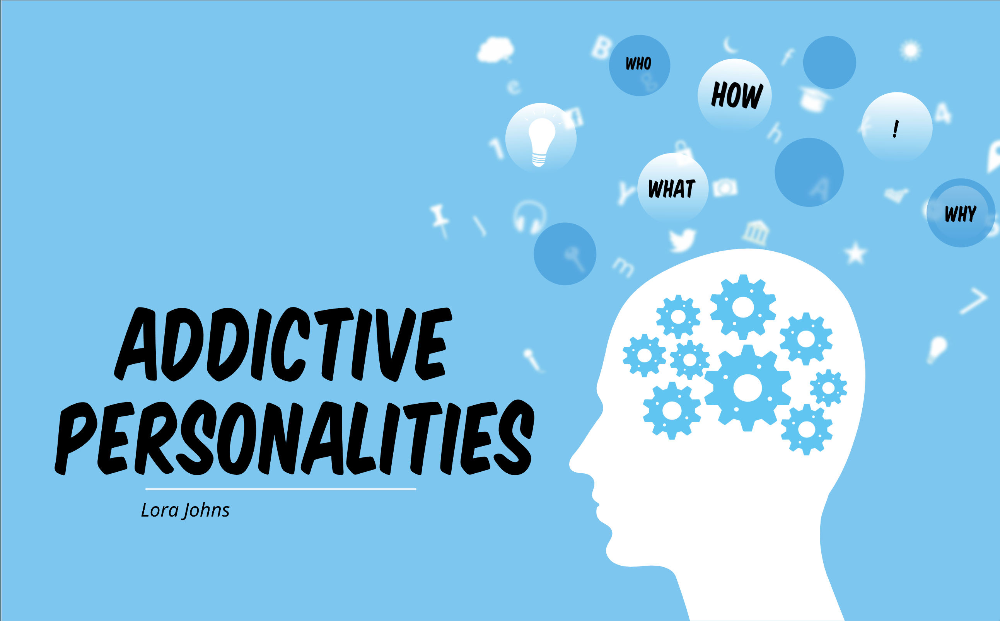
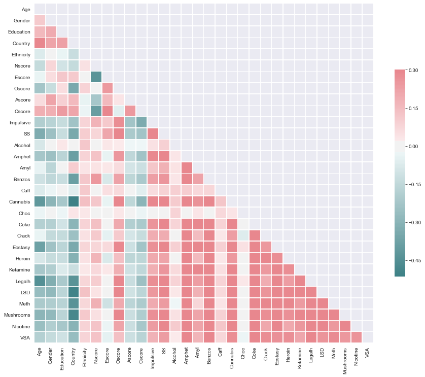
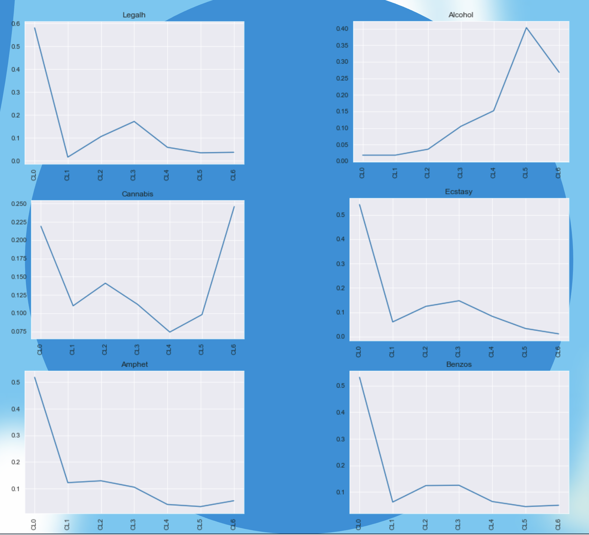
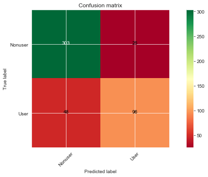
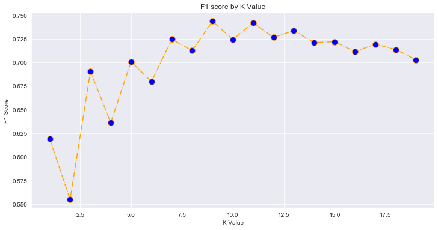
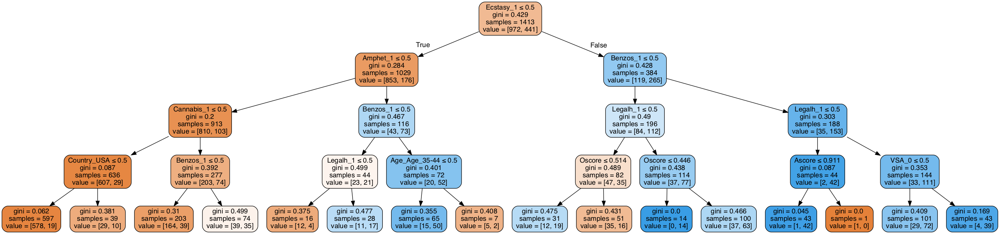

## Do personality traits 'predict' drug use?

+ _The Five Factor Model of personality and evaluation of drug consumption risk_, Fehrman et al. [link](https://arxiv.org/abs/1506.06297)
+ For this analysis, an "active user":
  + Used Heroin, Methadone, Crack, or Cocaine
  + Within the last year

+ This definition underlies the target variable. Why?

  + Highest risk population (real-world)
  + Create a reasonable target variable without introducing confusion (pragmatic)

## Models

_heatmap of features_

_percentage of users per group_

1. Multinomial Bayes
2. Logistic regression
3. K-nearest neighbors

_Confusion matrix_

_Multiple K testing_

4. Support vector classifier

5. Random forest

## Takeaways

+ In all models, ecstasy was the top discriminator (followed by benzos and legal highs)
+ Accuracy alone isn't enough
+ Interrogate the underlying research
+ The purpose to which you put your data matters
+ Examine bias (in the data and the people)
